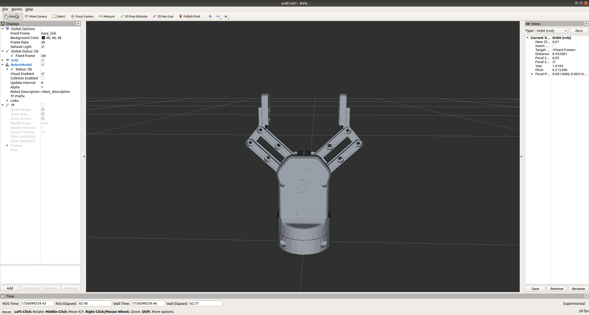

# ctag2f90d

## 一、环境配置说明

Ubuntu 18.04.6 LTS  
Python 3.6.9  
ROS melodic 1.14.13  

需要的python package：minimalmodbus  
安装minimalmodbus，在终端输入     `pip install minimalmodbus`

复制 **crt_ctag2f90d_gripper_visualization** 文件夹到你自己的ROS的workspace中
## 二、使用说明

### 1. 在连接好机器手后，确认在Ubuntu有USB端口  
在终端输入：
  `ls -l /dev/ttyUSB* `   
  确认USB端口名称后，修改端口使用权限  
  `sudo chmod 777 /dev/ttyUSB0`
  
### 2. 更新ROS环境  
在终端输入：
```sh
cd ~/ws_catkin

catkin_make
```

### 3. 启动riz节点  

```sh
# 如果要使用功能，在终端输入：
cd ./src/crt_ctag2f90d_gripper_visualization

roslaunch crt_ctag2f90d_gripper_visualization display_sync.launch  # 同步模式
```

输入完成，会出现rviz界面，如下图：


<center>图1 ctag2f90d rviz显示图</center>  
  
  

<center>图2 joint state publisher显示图</center>

如果出现关于<font color="red">**Could not find the GUI, install the ‘joint_state_publisher_gui‘ package**</font>，需要安装相应的软件包，在终端里输入：  
`sudo apt-get install ros-melodic-joint-state-publisher-gui `

点击RViz左侧Displays下的Fixed Frame从map改为base_link

再点击左下角add按钮，添加RobotModel

显示出机器模型



<center>图3 机器模型图</center>

